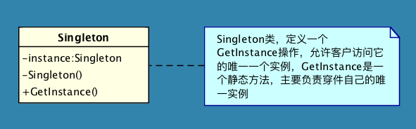
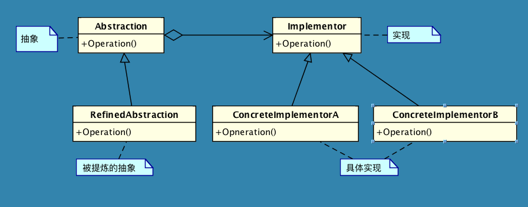
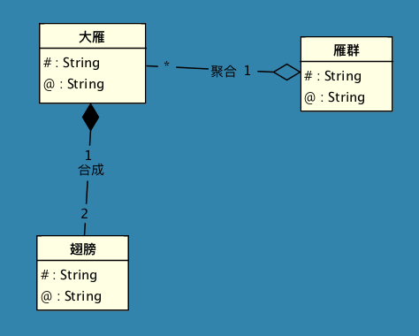

# DesignPattern
主要依据《大话设计模式》和《Design Pattern》一书中提到的各种设计模式进行编程实践，附带一些自己的思考。

##单例模式
**单例模式**(singleton): 保证一个类仅有一个实例，并提供一个访问它的全局访问点。

通常我们可以让一个全局变量使得一个对象被访问，但它不能防止你实例化多个对象。一个最好的办法是。让类自身负责保存它的唯一实例，这个类可以保证没有其他实例可以被创建，并且它可以提供一个访问该实例的方法

##访问者模式

##桥接模式

**桥接模式**: 将抽象部分和它的实现部分分离，使他们可以独立的变化

**Bridge**: Decouple an abstraction from its implementation so that the two can vary independently

使用继承的一个缺点就是，对象的继承关系在编译的时候已经确定好了，所以无法在运行的时候改变父类的继承的实现，子类的实现与父类有着非常紧密的依赖关系以至于父类实现中的任何变化必然影响到子类。当你需要复用子类时，如果继承下来的实现不适合解决新的问题，则父类必须重写或者被其他更合适的类代替，这种依赖关系限制了灵活性并最终限制了复用性。

当我们需要多角度的去分类我们的实现对象的时候，只用继承会造成大量的类增加，应该把这种多角度分离出来让他们独立变化

##设计模式原则

###单一职责原则(SRP)
就一个类而言，应该仅有一个引起它变化的原因

###开放——封闭原则
软件实体(类、模块。函数等等)应该可以扩展、但是不可修改。(Open for extension. Closed for modification)

无论模块是多么的“封闭”，都会存在一些无法对之封闭的变化，既然不可能完全封闭，设计人员必须对于他设计的模块应该对哪种变化封闭做出抉择。他必须先猜测出最有可能发生的变化种类，然后构造抽象来隔离那些变化。

当变化发生时，我们就创建抽象来隔离以后发生的同类变化。

面对需求，对程序的改动是通过增加新代码进行的，而不是更改现有的代码

###迪米特法则（LoD）

也叫最少知识法则：如果两个类不必彼此直接通信，那么这两个类就不应当发生直接的相互作用，如果其中一个类需要调用另一个类的某个成员方法的话，可以通过第三者转发这个调用

每一个类都应该尽量降低成员的访问权限，一个类包装好自己的privat状态，不需要让别的类知道的字段或者行为就不要公开

迪米特法则的根本思想，就是强调类之间的松耦合，类之间的耦合越弱，越有利于复用，一个处在弱耦合的类被修改，不会对有关系的类造成波及

###合成/聚合复用原则

尽量使用合成/聚合，尽量不要使用类继承

聚合表示一种弱的“拥有”关系，体现的是A对象可以包含B对象，但B对象不是A对象的一部分；合成则是一种强的“拥有”关系，体现了严格的部分和整体的关系，部分和整体的生命周期一样

在上述例子中，大雁有两个翅膀，是整体和部分的关系，它们的生命周期是相同的，但是大雁只能属于一个雁群，一个雁群有多个大雁，所以大雁和雁群是聚合关系

合成/聚合复用的原则的好处是，优先使用对象的合成和聚合将有助于保持每个类被封装，并被集中在单个任务上，这样类和类集成层次会比较保持较小的规模，并且不大可能增长为不可控制的庞然大物

